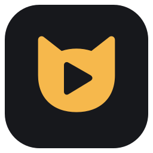

# Mochi — Linux replay capture



Native Qt app with a Medal-inspired clip library, 30/60-second replay buttons,
desktop + microphone audio, and offline “Mochi, clip that” voice activation.

## Start

```sh
git clone https://github.com/deltadasher/Mochi.git
cd Mochi
./setup.sh
./run.sh
```

Run `./setup.sh` once to prepare the Python environment and download the offline
English model. System requirements: Python, PySide6,
PipeWire's `pw-record`, `pactl`, FFmpeg/ffprobe, and GPU Screen Recorder with IPC
support (developed against 5.10.2). Setup downloads Vosk and its English model;
recognition itself runs locally.

1. In **Audio & voice**, select your microphone and click **Test microphone**.
2. Watch the input meter and say **“Mochi, clip that”**. Recognition feedback
   should show the phrase and confirm it was recognized. A mic test alone does
   not record your screen or save clips.
3. In **Capture**, choose the screen source. Click **Record**. If using the
   Wayland portal, select a screen in the system dialog.
4. Once recording, say your phrase or click **Clip 30s / Clip 60s**. The duration
   setting on the audio page determines the voice command's clip length.
5. Double-click a thumbnail to play it. Right-click to favorite it or open its
   folder. Search, date/size sorting, and the Favorites view work locally.

The same selected microphone is used by recognition and the clip recorder. Input
selection is locked during recording. Stop the buffer before changing inputs.
Voice boost affects recognition only; system microphone volume controls clip
volume. If the meter barely moves while speaking, check mute/volume in your system
sound settings, choose the right input, or move closer. **Refresh inputs** updates
the device list and displayed system volume.

The recognizer uses a focused phrase vocabulary, spelling variants for “Mochi,”
stable partial recognition, and a four-second cooldown. A full phrase is required;
“clip that” alone does not trigger. Change the phrase and click **Apply** if
needed. Custom phrases must contain at least three known English words.

The microphone test keeps listening until stopped. During recording, the Enabled
checkbox controls voice activation; microphone audio remains in your clips even
when voice activation is off. The most recent recognition is shown in memory only,
not written to a transcript or sent anywhere. Recognition is not speaker verification;
other voices audible to your microphone can trigger it.

Clips default to `clips/` beside the app. Settings, microphone selection, destination,
and favorites persist in `settings.json`. Thumbnail images cache in `.cache/`.
Desktop audio includes other applications such as Discord, mixed with mic audio.

With a system tray, closing the window leaves Mochi running. Use **Quit Mochi** in
the tray to exit. Without a tray, closing stops recording. Launch opens idle.

## Niri shortcut

Replace the example path with your checkout location and add this inside your
existing `binds` block:

```kdl
Mod+F8 { spawn "/absolute/path/to/Mochi/run.sh" "--clip" "default"; }
```

Use `30` or `60` instead of `default` for a fixed duration. Mochi must be buffering.
The command acknowledges the request; the app confirms actual completion.
Mochi does not change compositor settings automatically.

## Diagnostics and checks

```sh
./run.sh --status
./run.sh --quit
QT_QPA_PLATFORM=offscreen .venv/bin/python -m unittest discover -v
```

Tests cover IPC failures, capture controls, disabled-state behavior, voice event
routing, partial-result deduplication, saved preferences, search/favorites, and real
Vosk recognition of synthesized positive/negative speech fixtures. Fixtures were
created locally with Flite; Flite is not a runtime dependency. UI tests use temporary
profiles and a simulated recorder, never your microphone. A separate development
check exercised synthesized speech through the real voice subprocess and GPU
recorder, and inspected the saved video/audio streams.

## Current limits

Voice accuracy still depends on pronunciation, microphone quality, and background
noise. Synthesized test speech does not establish accuracy for every user's voice.
The buffer bar estimates elapsed time from recorder readiness. New buffers produce
shorter clips; codec keyframes affect exact duration. The library is a local browser
and player, with no trimming, uploads, accounts, game auto-detection, or auto-start.
Wayland portal support depends on your desktop; direct screen capture is available
as an alternative. Direct capture has been tested on Arch Linux with Niri and AMD graphics.

References: [Medal UI reference](https://support.medal.tv/support/solutions/articles/48000959661/),
[Vosk](https://alphacephei.com/vosk/), [English model](https://alphacephei.com/vosk/models),
[PipeWire capture options](https://docs.pipewire.org/page_man_pw-cat_1.html), and
`man gpu-screen-recorder.1`. The downloaded English model is Apache 2.0 licensed;
retain its bundled files. Dependencies retain their own respective licenses.
